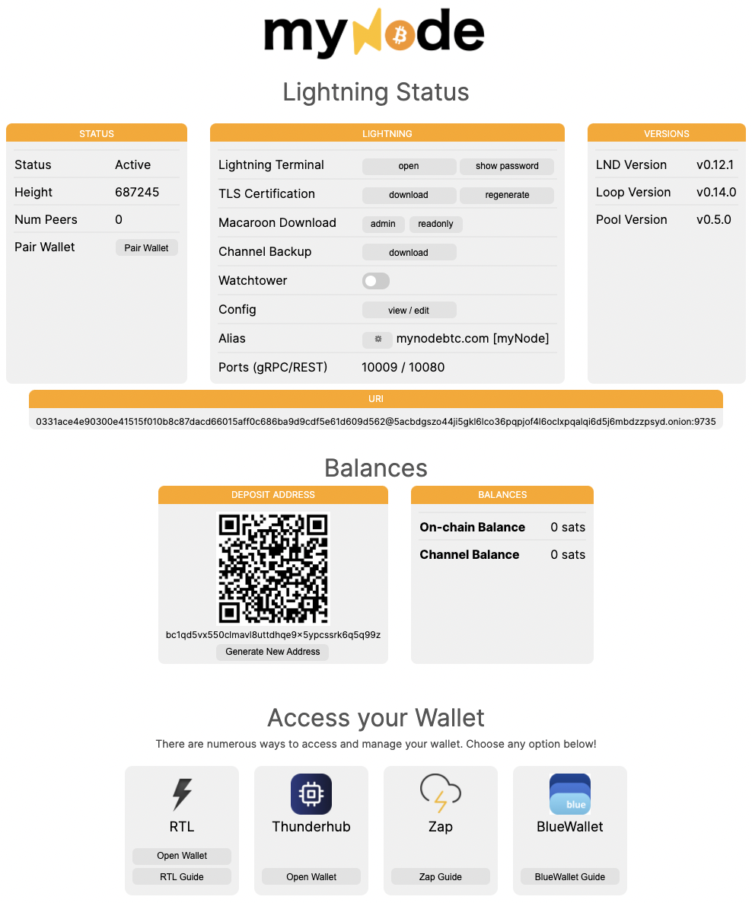
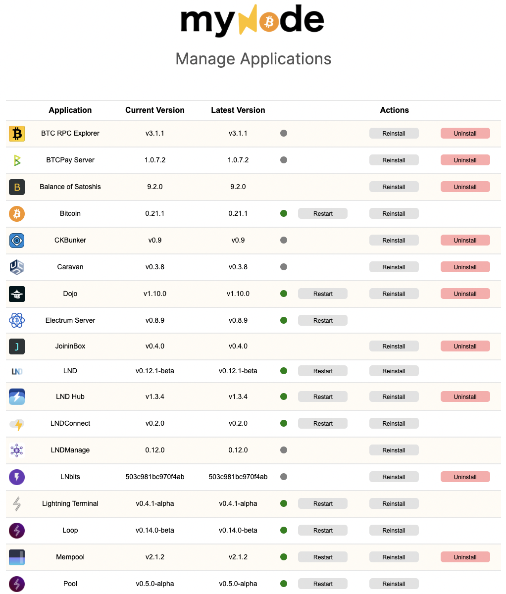
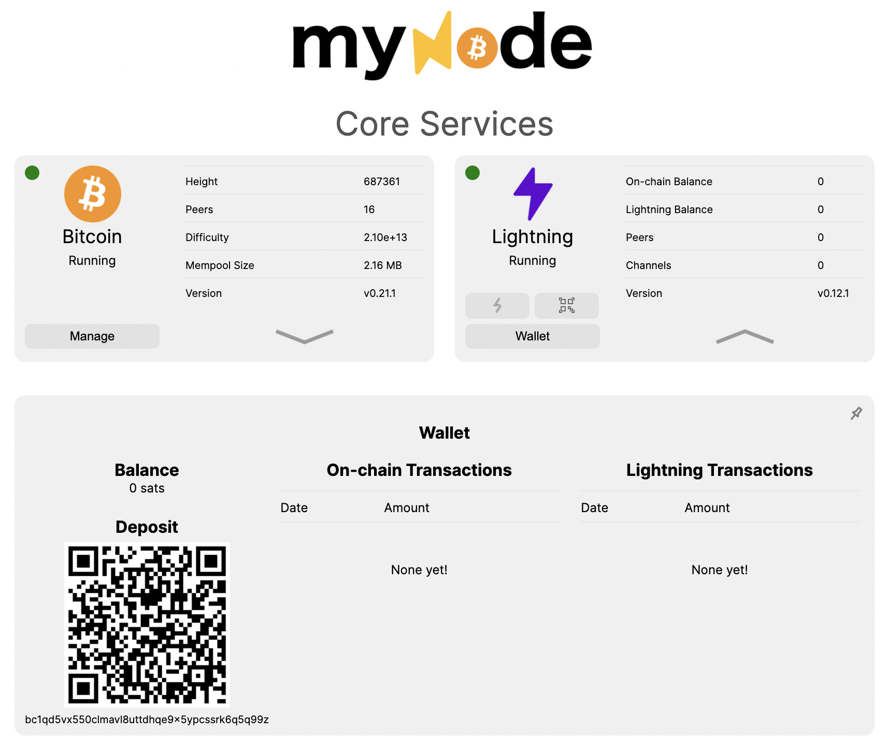

# myNode
The easiest way to run Bitcoin and Lightning!

myNode aims to be the easiest way to run a dedicated, easy to use, Bitcoin Node and Lightning Wallet! By combining the best open source software with our UI, management, and monitoring software, you can easily, safely, and securely use Bitcoin and Lightning.

Website: https://mynodebtc.com

## GUI

## Overview
myNode aims to be the easiest way to run a dedicated, easy to use, Bitcoin Node and Lightning Wallet! By combining the best open source software with our UI, management, and monitoring software, you can easily, safely, and securely use Bitcoin and Lightning.

myNode is a software that integrates a number of Bitcoin related open source projects and provides access to the Bitcoin and Lightning networks along with a number of other features! By using a dedicated device, like myNode 1, you get uptime, reliability, and ease-of-use that other software-only solutions cannot provide.

By running a Bitcoin node and Lightning on your myNode device, you maintain all the security and advantages originally intended in the Bitcoin protocol. Information about your Bitcoin addresses and spending is verified by your local node and removes the need to trust online 3rd parties for getting information about your funds.

## myNode Premium
myNode offers premium support, simplified upgrades and more! If you are running myNode Community Edition and want one-click upgrades or you want to purchase a supported, high quality device, please visit mynodebtc.com.

Upgrade now or purchase a device at: 
https://mynodebtc.com/order_now

<b>myNode 1 Device</b>
 

## Features
Each myNode device comes with a number of wonderful features:

- Bitcoin Node
- Lightning Node (LND)
- Simple UI / Web Interface
- VPN for Remote Access
- Bitcoin Explorer
- Electrum Server - BTC Light Wallet Server
- Ride the Lightning - Lightning Wallet
- LND Hub - Lightning Wallet Server
- JoinMarket CLI
- Bitcoin CLI
- QuickSync - Quickly sync Bitcoin blockchain
- LND Connect - Generate QR Codes for connecting wallets
- LN Channel Backup
- Tor
- Docker support
- Netdata Monitor
- Glances
- Web Linux Terminal (WebSSH2)
- Dark Mode interface
- Dedicated hardware keeps you constantly and securely connected!
- Virtual Machine support (OVA file, VirtualBox)
- Mempool.space local full node integration
- Samourai Whirlpool
- And more!

## Supported Devices
We currently support images for the following devices:
 - Raspberry Pi 3
 - Raspberry Pi 4
 - Rock64
 - RockPro64
 - Virtual Machine Support (VirtualBox hosting Windows/OS X/Linux/Solaris)

## Running myNode
You can run myNode on your own device in just a few easy steps!

1. Download an Image
    * [Downloads](https://mynodebtc.com/download)
2. Flash Image onto SD Card
    * Download [Etcher](https://www.balena.io/etcher/)
    * Flash Downloaded Image
3. Insert SD Card and Boot your Device
4. Attach External HD to Device
    * 1TB+ Required
5. Visit http://mynode.local/ or http://ip_of_device/

## Developing for myNode
Once you are running myNode, you can easily modify and update the software yourself!

1. Start by running myNode on your device via the instructions above in "Running myNode"
2. Modify myNode files
    * Clone this git repo on your PC or laptop - 'git clone https://github.com/mynodebtc/mynode.git'
    * Make your modifications
3. Run 'make rootfs'
    * Or run 'make rootfs_auto' in a new console tab
    * This will automatically create artifacts as local files are modified
4. Run 'make start_file_server'
    * This will run a local HTTP server so your device can download files
5. On your device, run 'sudo mynode-local-upgrade [dev pc ip address]'
    * This will download your locally generated artifact and install it on your device
    * Your device will automatically reboot to ensure updates take effect
6. Test your changes!
7. Submit Pull Request to share your updates!

### To update a subsystem without rebooting
Add another argument to the local upgrade script:
- To update files only, run `sudo mynode-local-upgrade [dev pc ip address] files`
- To update files and restart web server, run `sudo mynode-local-upgrade [dev pc ip address] www`

## Upgrading your myNode
Once you are running myNode, you can easily update the software yourself!

1. Start by running myNode on your device via the instructions above in "Running myNode"
2. Clone this git repo on your PC or laptop
    * Run 'git clone https://github.com/mynodebtc/mynode.git'
    * Run 'cd mynode'
3. Run 'make rootfs'
4. Run 'make start_file_server'
    * This will run a local HTTP server so your device can download files
5. On your device, run 'sudo mynode-local-upgrade [dev pc ip address]'
    * This will download your locally generated artifact and install it on your device
    * Your device will automatically reboot to ensure updates take effect
6. You are now running the latest version of myNode software!

## Convert new device to run myNode
1. Run make command for your device. Ex:
    * make setup_new_rock64
    * make setup_new_rockpro64
    * make setup_new_raspi3
    * make setup_new_raspi4
    * make setup_new_debian
    * make setup_new_other
3. Follow Instructions
2. Reboot Device
4. Congratulations! You're running a new myNode device!

## Screenshots

--------------------

--------------------

--------------------

## What is Bitcoin?
Bitcoin is a unique form of digital money that enables users to send money over the Internet securely without the need for banks or other 3rd parties. This enables anyone with Internet access the ability to participate in the global economy no matter where they live - anywhere from rural Africa to Venezuela to Antarctica to space!

Bitcoin is also unique in that it is deflationary and only has a finite amount of Bitcoin that will ever exist - 21 million. This is similar to land or other valuable natural resources that are limited in their supply. This limited supply is based on computer software algorithms built into the Bitcoin protocol. No person, company, or government can change that limit. This makes Bitcoin valuable to many people who want to save money.

Bitcoin works by a large network of computers constantly working to verify transactions. Every 10 minutes a new set of transactions is included in a new block. Once a transaction is included in a block, the money belongs to the recipient and only they have the ability to spend their newly acquired Bitcoin. These blocks build on top of one another forming what is referred to as the blockchain.

The Lightning Network is another layer on top of Bitcoin, speeding up the rate at which Bitcoin can be sent. Bitcoin transactions are very secure, but can take 10 minutes or more to fully confirm. The Lightning Network allows people to send Bitcoin back and forth without the need to wait for each transaction to get included in a Bitcoin block.

There is much more to Bitcoin and the Lighting Network than is mentioned here. For more information, start with these links.

<a href="https://www.upfolio.com/ultimate-bitcoin-guide">Ultimate Bitcoin Guide</a>

<a href="https://medium.freecodecamp.org/explain-bitcoin-like-im-five-73b4257ac833">Explain Bitcoin Like I’m Five</a>

<a href="https://www.lopp.net/bitcoin-information.html">Bitcoin Information</a>

## Security
There are many reasons to run a Bitcoin Node, like a myNode device will give you. It helps keep the Bitcoin network secure and reduces the trust you are giving others when using 3rd party Bitcoin Explorers or Bitcoin Light Wallet servers. They can track you or give you false information, reducing your security. A “full node”, like the Bitcoin node running on your myNode device, personally validates all blocks in the Bitcoin blockchain making sure your Bitcoin transactions and Lightning network use is built on the strongest, most trusted foundation possible.

By using myNode for your Lightning Wallet,  Bitcoin Wallet, and Block Explorer, you no longer have to trust others to give you the correct information! This increases your security when protecting your valuable assets.

Please note, we are not responsible for any lost funds while using your myNode device. We have taken significant measures to protect your assets by securing myNode devices, but lightning wallets are meant to be online and used for spending where risks are greater. Please do your own research into Bitcoin and the Lightning Network before investing in cryptocurrency.

For long term storage of cryptocurrency assets, please consider using a hardware wallet, like a Ledger or Trezor.

## Community
myNode has a wonderful, helpful community that assists with development and support. It would be impossible to run this project without their involvement and support! I truly appreciate the time and effort everyone puts in to make this a success.

In order to maintain high quality premium support for myNode customers, community contribtions may be included as part of the Premium software package so that the additional features can be maintained and supported long-term. Community members are welcome to contact myNode and be included in an upcoming list of community contributors that will highlight their contributions and, optionally, solicit donations. Additionally, any donations to myNode will be shared with the community developers and downstream projects at the discretion of the myNode team.